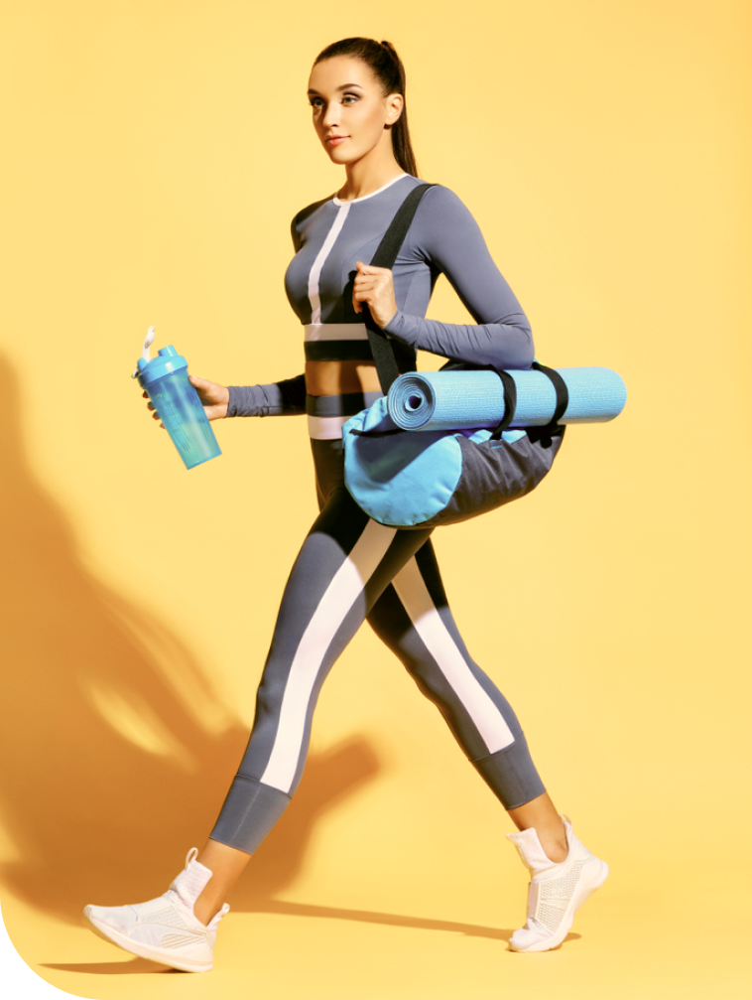

<h1 align="center">
   
     
</h1>

  
  
  
  
  
  
  
  
  

<h4 align="center">
  
Golds Gym

  

Com a funcionalidade de escolher as categorias de exercícios e grupos musculares específicos, navegar por mais de mil exercícios com exemplos práticos, paginação, detalhes de exercícios, com vídeos relacionados do youtube e com exercícios semelhantes.
  
  

</h4>

## :rocket: Tecnologias

Este projeto foi desenvolvido com as seguintes tecnologias:

-  React
-  HTML
-  CSS
-  Material UI
-  RapidAPI

## :eyes: Confira

Você pode acessar por aqui:

-  [Golds Gym][demo]

<h4 align="center">
    Feito com ♥ por Flavio Tobias 👋 <a href="https://www.linkedin.com/in/flaviotobias/" target="_blank">Entre em contato!</a>
</h4>

[vc]: https://code.visualstudio.com/
[vceditconfig]: https://marketplace.visualstudio.com/items?itemName=EditorConfig.EditorConfig
[vceslint]: https://marketplace.visualstudio.com/items?itemName=dbaeumer.vscode-eslint
[demo]: https://flavio-gym.netlify.app/

